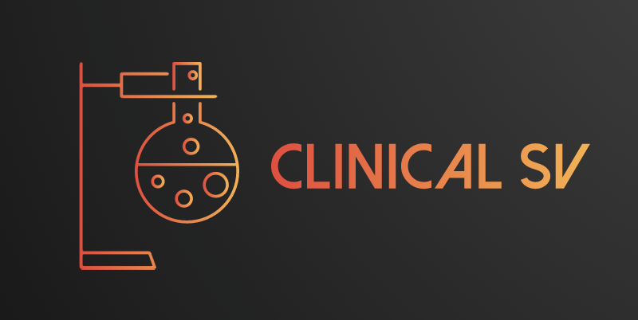
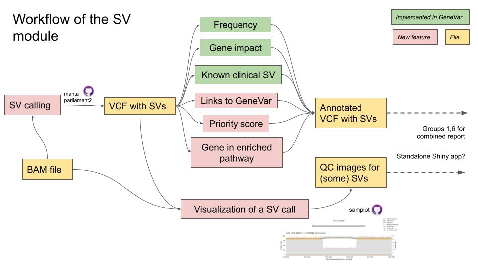

# clinical_SVs

Clinically reportable structural variant calls

## Contributors

Jean Monlong  - `Lead, Liaison`

Rupesh Kesharwani - `Sysadmin and code developer`

Pranav Khade - `Data Guru and code Developer`

Weiyu Zhou - `App Developer`

Ahmad Al Khleifat - `Writer`

## Goals

Write a **workflow and/or app** to **annotate structural variants** (SVs) calls with **clinically relevant information**.

Eventually, the workflow could call the SVs from sequencing reads (e.g. from a BAM file) and extract some QC information from raw reads.

## Overview Diagram

## Notes/Documentation

For the *gene-level* metrics, the relevant (new) fields in the annotated VCF will be:

| name   | description                           |
|--------|---------------------------------------|
| AF     | Allele frequency                      |
| CLINSV | the ids of matching known clinical SV |
| GENE   | name of the gene(s) overlapped        |

We will also run a gene set enrichment and highlight SVs in enriched pathways/diseases.
This is will represent a set of *patient-level* metrics.
The output will be a set of graphs (image files) 

## Installation

## Quick Start

## Component Details

Two ways to use our tools:

1. A **command-line workflow** that can do
   - SV discovery
   - Annotation
   - Automated QC graphs of supporting reads
1. An **interactive app** to annotate a VCF with SV calls and visualize the results.
   - Building on GeneVar but now the user can upload their own VCF

### SV calling

If needed SVs can be called using parliament2. 
We will provide commands to run this variant discovery and integrate it to the workflow

### Annotation of SVs in R

The different modules of the annotation are written as functions and saved in separate files.
Then the master annotation script can read a VCF, *source* these functions and use them to annotate the SVs. 
See the current master annotation script [`annotate_vcf.R`](annotate_vcf.R) and the different scripts *source*d inside.

The `server.R` file of the app can also use the same approach: source the same functions and use them to annotate a VCF before displaying the info in the app.

#### Annotation modules

- [ ] [`annotate_genes.R`](annotate_genes.R) 
   - **TODO**. Currently returns dummy test values.
   - In GeneVar, the gencode annotation was downloaded from `ftp://ftp.ebi.ac.uk/pub/databases/gencode/Gencode_human/release_35/gencode.v35.annotation.gff3.gz`
   - See [script to prepare gencode annotation from GeneVar](https://github.com/collaborativebioinformatics/GeneVar/blob/whole-genome/scripts/prepare_gencode.R)
   - See [annotation function in GeneVar server.R](https://github.com/collaborativebioinformatics/GeneVar/blob/3db5b83f0c61e4aa1ab80022b32864cb8b623017/shinyapp/server.R#L32-L56)
- [ ] [`annotate_frequency.R`](annotate_frequency.R) 
   - **TODO**. Currently returns dummy test values.
   - See uploaded gnomAD-SV TSV for GRCh38 (easier that dealing with hg19) in the DNAnexus project: `gnomad_v2.1_sv.sites.lifted.tsv.gz`
   - See [GeneVar script for frequency annotation](https://github.com/collaborativebioinformatics/GeneVar/blob/whole-genome/scripts/annotate_freq.R)
   - See [GeneVar script to format the gnomAD-SV fields](https://github.com/collaborativebioinformatics/GeneVar/blob/whole-genome/scripts/prepare_gnomadsv_freq.R) (maybe not as relevant).
- [ ] [`annotate_known_clinical_SVs.R`](annotate_known_clinical_SVs.R)
   - **TODO**. Currently returns dummy test values.
   - Known clinical SVs in dbVar can be downloaded at `https://ftp.ncbi.nlm.nih.gov/pub/dbVar/data/Homo_sapiens/by_study/tsv/nstd102.GRCh38.variant_call.tsv.gz`
   - This TSV was parsed in GeneVar with [this command line](https://github.com/collaborativebioinformatics/GeneVar/blob/3db5b83f0c61e4aa1ab80022b32864cb8b623017/scripts/Snakefile#L123-L127)
   - These variants could be matched using the same approach as in the frequency annotation.
- [ ] [`geneFunctionalAnnotation.R`] (geneFunctionalAnnotation.R)
   - Need a list of list of genes similar to `listofENSEMBLID.txt` (Other than ENTREZ Gene ID; such as SYMBOL / REFSEQ / ENSEMBL) to output a three types of Disease Ontology plots such as `(geneAnnotation.png)` including a barplot (high level catogory), a dot plot (show upto 20 diseases association) and a disease-gene network graph.
   - The list of genes can be extracted from annotated vcf based on any SV types.

### Visualization of aligned reads around a SV

We could show the reads around a SV as a quality control if the BAM is available.
Either invent our own graph (for example in python), or run an existing tool like [samplot](https://github.com/ryanlayer/samplot).
